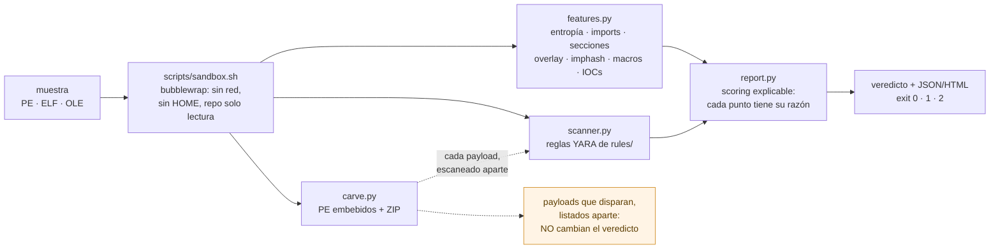
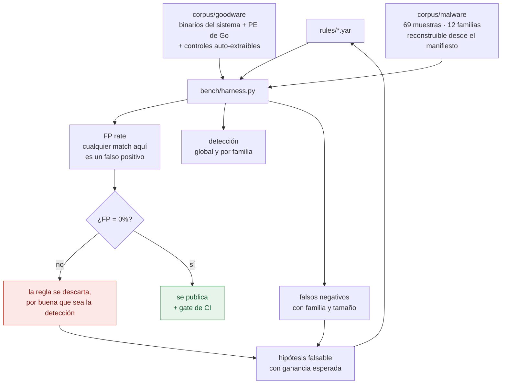

# Crisol: motor de triaje estático de malware + banco de reglas YARA

> Analiza binarios (PE / ELF / documentos ofimáticos) **sin ejecutarlos**, los
> puntúa con heurísticas explicables y coincidencias YARA propias y, sobre
> todo, **mide la calidad de esas reglas** contra corpus de goodware y
> malware. Detection engineering, no una caja negra.

  

*El crisol es donde se funde el metal para ensayarlo: no fabrica nada, solo
revela lo que no aguanta la prueba. Aquí lo que se ensaya son reglas YARA, y
más de una no ha salido entera.*

## Por qué este proyecto

Cualquiera puede correr `yara reglas.yar muestra.exe`. Lo que distingue a un
analista es saber **cuánto vale una regla**: ¿cuántos falsos positivos genera
contra software legítimo? ¿qué tasa de detección real tiene? Este proyecto
convierte esa pregunta en un número reproducible.

Ejemplo real del baseline de este repo: un binario **legítimo y firmado de
Microsoft** clasificado como malicioso por reglas demasiado laxas:

```
$ crisol scan winhttp-proxy-shim.exe
  veredicto malicious-likely  (score 75/100)      <-- FALSO POSITIVO
  YARA: dynamic_api_resolution_and_alloc, anti_debug_checks
```

### Afinado guiado por métricas (antes → después)

El harness midió la tasa de falsos positivos sobre 52 binarios legítimos y
guió el rediseño de cada regla. Cada cambio está justificado con datos:

| Regla | FP antes | FP después | Qué cambió (y por qué) |
|-------|:-------:|:---------:|------------------------|
| `anti_debug_checks` → `anti_debug_stacked` | **12.2%** | **0%** | Una sola API (`IsDebuggerPresent` del CRT) es ubicua. Se estratifican las APIs en *fuertes* (nivel NT, raras en goodware) vs *ubicuas*, y se exigen 2 fuertes o 1 fuerte + 2 ubicuas. |
| `dynamic_api_resolution_and_alloc` → `..._small_iat` | **4.5%** | **0%** | `LoadLibrary`+`GetProcAddress` es normal en software grande (IAT de 100-258 fns). Los loaders reales tienen IAT **diminuta**; se añade `number_of_imported_functions < 30`. |
| `vba_powershell_invocation` | **0.6%** | **0%** | Disparaba sobre PEs donde `"powershell"` aparece legítimamente. Ahora excluye binarios PE/ELF nativos. |
| **Global** | **12.18%** | **0.0%** | 52 muestras de goodware, 0 marcadas. |

### Y el otro lado del banco: detección real

Unas reglas que no disparan nunca también tienen 0% de FP, así que el número
anterior por sí solo no dice nada. Contra **69 muestras reales de MalwareBazaar**
(12 familias) y 57 de goodware:

| Métrica | Valor |
|---|---|
| Falsos positivos (57 goodware) | **0.0%** |
| Detección (69 muestras reales) | **28.99%** |

Dos autopsias, y las dos van de lo mismo: **el banco vale lo que valga el corpus
de goodware.**

- **[Ronda 1](docs/hallazgos-deteccion.md)** (19 muestras).
  `dynamic_api_resolution_small_iat`, la regla que mejor bajó los FP en la tabla
  de arriba, tiene **0 verdaderos positivos**. El umbral `IAT < 30` se ajustó
  mirando solo goodware; el malware real importa entre 39 y 658 funciones.
  Sobreajuste de manual, medido y documentado.
- **[Escaneo recursivo](docs/escaneo-recursivo.md)**: abrir los contenedores sube
  la detección a 37.68%, y ese número **no está en la tabla de arriba a
  propósito**: las 6 detecciones nuevas salen de `high_entropy_section`
  disparando sobre assemblies .NET embebidas, y un instalador legítimo de
  ScreenConnect dispararía igual. Sin goodware .NET no se puede falsar, así que
  no se firma.
- **[Ronda 2](docs/ronda-2-reglas.md)** (69 muestras). De las tres hipótesis que
  dejó la ronda 1, una se publica (+5 detecciones sin tocar el 0% de FP), otra se
  **refuta** y otra se declara **bloqueada**. El "cluster de crypter" que iba a
  ser la pieza de mayor rendimiento resultó ser **el runtime de Go**: la regla que
  lo caza marca `fmt.Println("hola")` compilado para Windows, y marcó **5 de 5**
  binarios legítimos de Go en cuanto se metieron en el corpus. Habría dado 0% de
  FP contra el corpus de la ronda 1, que no tenía ni uno.

Métricas crudas versionadas en [`bench/metrics-2026-09-07.json`](bench/metrics-2026-09-07.json)
(y las de la ronda 1 en [`bench/metrics-2026-09-03.json`](bench/metrics-2026-09-03.json));
el corpus de malware es reconstruible desde
[`bench/corpus_manifest.json`](bench/corpus_manifest.json) (sha256 y familia; las
muestras no se redistribuyen) y el de goodware de Windows con
[`bench/make_goodware_go.sh`](bench/make_goodware_go.sh).

## Arquitectura

### Cómo se analiza una muestra

Nada se ejecuta: todo es lectura de bytes, y encima dentro de un sandbox.



### Cómo se mide una regla

Esto es lo que distingue al proyecto. Una regla no vale por lo que caza, sino
por lo que caza **sin marcar software legítimo**, y eso es un número.



El bucle de la derecha es el trabajo real: los falsos negativos son la lista de
tareas de la siguiente ronda de reglas, y el criterio de aceptación no se
negocia. Las dos rondas hechas hasta ahora están documentadas en
[`docs/`](docs/), incluida la que terminó **tirando** la regla que más prometía.

| Módulo | Qué hace |
|--------|----------|
| `src/crisol/features.py` | Extracción estática: hashes, entropía global/por-sección, imports (con lista curada de APIs abusadas), imphash, overlay, secciones RWX, macros VBA (oletools), IOCs (URLs/IPs/dominios/registro). |
| `src/crisol/scanner.py`  | Compila todo `rules/**/*.yar` en un ruleset y ejecuta el match, opcionalmente también sobre los payloads embebidos. |
| `src/crisol/carve.py`    | Talla PE embebidos sin comprimir y abre ZIP, para escanear lo que hay *dentro* de un contenedor. Con topes: cada offset lo elige el fichero analizado. |
| `src/crisol/report.py`   | Scoring ponderado **explicable** (cada punto tiene su razón) + salida JSON y HTML. |
| `src/crisol/cli.py`      | `scan`, `features`, `rules`. Exit code 0/1/2 = limpio/sospechoso/malicioso (útil en pipelines). |
| `bench/harness.py`          | El banco de pruebas: métricas de FP/detección por regla, con umbral para CI. |
| `bench/make_goodware_go.sh` | Genera goodware de Windows (PE de Go + un auto-extraíble de control) que el corpus no tenía y sin el cual el 0% de FP no significa nada. |
| `tests/minipe.py`           | Constructor de PE mínimos y válidos en memoria: permite probar las reglas del módulo `pe` en CI sin que ninguna muestra viaje al repo. |
| `rules/`                    | Reglas YARA propias, con `author`/`date`/`severity`/`mitre`/`reference`. |

## Uso

```bash
make install                          # crea .venv e instala dependencias
make rules                            # compila y valida el ruleset
make scan SAMPLE=/ruta/muestra.exe    # triaje de una muestra
make bench                            # métricas de FP/detección
make test

# salidas alternativas
crisol scan muestra.exe --recursive       # escanea también lo que lleva dentro
crisol scan muestra.exe --json > report.json
crisol scan muestra.exe --html reports/muestra.html
```

## El corpus (importante)

- **Goodware**: binarios legítimos del sistema (`/usr/bin`, DLLs de Windows/Wine)
  más PE de Windows generados con `make goodware` (programas triviales de Go y un
  auto-extraíble de control). Cualquier match aquí es un falso positivo.
  Esa segunda mitad no es un adorno: [una regla entera murió](docs/ronda-2-reglas.md)
  el día que entró en el corpus.
- **Malware**: se descarga de [MalwareBazaar](https://bazaar.abuse.ch) con
  `bench/fetch_malwarebazaar.py` (ZIP con contraseña `infected`). **Nunca se
  ejecutan** y **nunca se suben al repo**.

> **Cómo se manejan las muestras sin pegarse un tiro en el pie:**
> guardadas `0400` con el sha256 verificado, análisis aislado en bubblewrap
> (sin red, sin `$HOME`, repo de solo lectura) y un hook `pre-commit` que
> impide subirlas. El modelo de amenaza completo, con lo que se hace y lo que
> deliberadamente no, está en **[docs/manejo-seguro-muestras.md](docs/manejo-seguro-muestras.md)**.

```bash
make hooks           # hook anti-fugas (hazlo ANTES de descargar nada)
make sandbox-bench   # el bench, con el analizador aislado
```

```bash
export MB_API_KEY=...                  # gratis en bazaar.abuse.ch
# o bien:  echo '<clave>' > .mb_api_key   (gitignored)

make goodware                          # goodware de Windows (necesita el toolchain de Go)
make corpus                            # TAG=exe LIMIT=30 MAXFAM=3 por defecto
python bench/fetch_malwarebazaar.py --tag exe --limit 30 --max-per-family 3 --dry-run
```

El fetcher tope por familia (`--max-per-family`) para que el corpus no sea
monotemático, salta lo ya descargado y escribe `bench/corpus_manifest.json`
(sha256 → familia, tipo, tags). Con ese manifiesto el harness desglosa la
**detección por familia** y lista los **falsos negativos**, que son la lista de
tareas de la siguiente ronda de reglas.

## Roadmap

- [x] Extracción de features PE/ELF/OLE + scoring explicable
- [x] Ruleset YARA propio con metadatos y módulo `pe`/`math`
- [x] Harness de FP/detección por regla + gate en CI
- [x] **Afinado de reglas guiado por métricas** (FP rate 12.18% → 0%, documentado en la tabla de arriba)
- [x] **Medición de detección sobre malware real** (36.84% con 0% de FP,
      [autopsia documentada](docs/hallazgos-deteccion.md))
- [x] **Manejo seguro de muestras**: almacenamiento sin bit de ejecución, sandbox
      de bubblewrap con aislamiento verificado por tests, y hook anti-fugas
      ([documentado](docs/manejo-seguro-muestras.md))
- [x] **Subir la detección sin romper el 0% de FP**: las tres hipótesis de la
      ronda 1, pasadas por el banco: overlay desproporcionado **publicada** (+5),
      cluster de crypter **refutada** (era Go), .NET **bloqueada** por falta de
      goodware con el que falsarla ([ronda 2](docs/ronda-2-reglas.md))
- [x] **Endurecer el gate de CI**: `tests/minipe.py` genera PE mínimos válidos en
      memoria, así que la CI vigila también la **detección** sin subir muestras; y
      `make_goodware_go.sh` le da al runner goodware de Windows real, con el gate
      de FP ya en `--max-fp-rate 0.0`
- [ ] **Goodware .NET**: bloquea dos cosas, la hipótesis 3 y validar las 6
      detecciones del escaneo recursivo. Es lo siguiente que más vale
- [x] **Abrir contenedores**: tallado de PE embebidos y de ZIP, con la detección
      recursiva contada aparte de la directa
      ([qué se midió y por qué no me lo creo](docs/escaneo-recursivo.md))
- [ ] **Descomprimir instaladores** (Inno, NSIS): el tallado solo llega a los
      payloads sin comprimir, así que las dos ValleyRAT de Inno Setup siguen
      pasando
- [ ] **Módulo de evasión controlada**: empaquetar/ofuscar muestras benignas para
      mostrar cómo rompen la detección, y endurecer las reglas en consecuencia
      (el ciclo rojo↔azul es el gancho de entrevista)
- [ ] Export de IOCs a **STIX 2.1 / MISP**
- [ ] Desensamblado con capstone: detección de patrones de shellcode
- [ ] Comparativa de detección frente a ClamAV
- [ ] Dockerfile + informe HTML con capturas

## Ética y alcance

Herramienta **defensiva y educativa** de análisis estático. No ejecuta muestras.
El corpus de malware se maneja en local, cifrado en su ZIP de origen, y jamás se
versiona. El módulo de evasión opera sobre binarios benignos de prueba para
estudiar los límites de la detección, no para producir malware funcional.

## Licencia

MIT. Jorge García, 2026.
